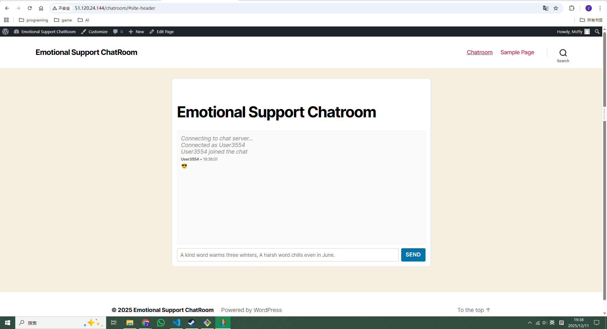

# 🥰 Emotional Support Chatroom

A real-time Emotional Support Chatroom built with a modern multi-service architecture and deployed on an Azure Virtual Machine using Docker Compose.

This project integrates:

- WordPress — front-end website & chatroom UI
- Node.js API — backend WebSocket server for real-time messaging
- Nginx — reverse proxy and unified entry point
- Docker Compose — orchestrates and manages all services

---

## Features

- Real-time chat powered by WebSocket
- WordPress-based UI for easy management and customization  
- Node.js backend handling WebSocket connections and broadcasting
- Nginx reverse proxy routing traffic to WordPress and the API  
- Fully containerized deployment with Docker Compose
- Designed to run continuously on Azure VM with minimal maintenance

---

## System Architecture
```scss
Client (Browser)
        ↓
     Nginx (Reverse Proxy)
   ┌──────────────┐
   ↓              ↓
WordPress      Node.js API (WebSocket)
   ↓
MySQL Database
```

All components run inside Docker containers and are coordinated via docker-compose.yml.

---

## Project Structure
```bash
ES-chatroom/
├── api/
│   ├── server.js
│   ├── package.json
│   └── Dockerfile
├── wordpress/
├── nginx/
│   └── nginx.conf
├── docker-compose.yml
└── README.md
```

---

## Technologies Used

- **Microsoft Azure Virtual Machine (Ubuntu)**
- **Docker & Docker Compose**
- **WordPress**
- **Node.js + WebSocket**
- **Nginx reverse proxy**
- **MySQL**

---

## ▶ How to Run (on Azure VM)

1. Make sure Docker is installed
```bash
docker --version
docker compose --version
```

2. Start all services
```bash
docker compose up -d
```

3. View logs (helpful for debugging)
```bash
docker compose logs -f
```

4. Stop the services
```bash
docker compose down
```

---

## Screenshots


---

## Demo
Link: https://youtu.be/WnCXO7zE-iA

---

## ☑ Deployment Notes

- WordPress is accessible at:
http://server-ip/chat/  <!-- 51.120.24.144 --> 

- The chatroom page template is stored inside the WordPress theme
- The WebSocket server runs inside the api container
- Nginx handles routing:
    - / → WordPress
    - /chat → Node.js API (WebSocket + HTTP)

---

## 🌟Future Improvements

- User authentication system
- Moderation / report system
- Store chat history in a database
- Add HTTPS via Let's Encrypt
- Admin dashboard for viewing chat logs
---

## License
MIT License.

Project development & deployment on Azure VM.
